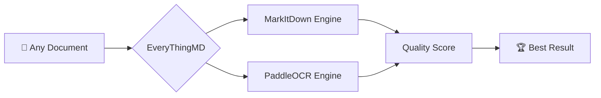
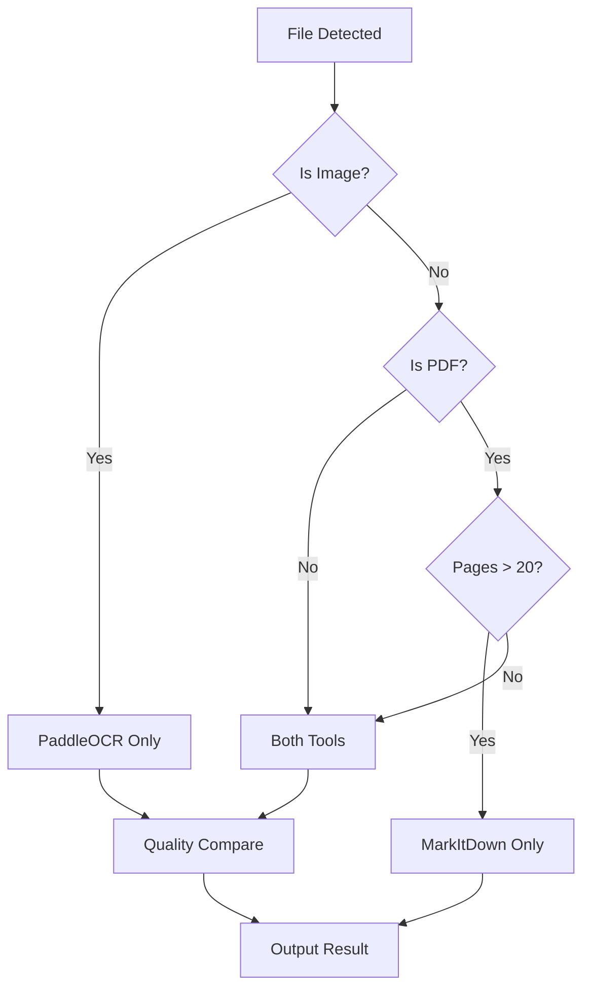

<div align="center">

# 🔥 EveryThingMD

**AI-Powered Document to Markdown Converter**

*Intelligent dual-engine conversion with quality comparison & auto-selection*

[](https://www.python.org/)
[](LICENSE)
[](https://github.com/huangxiding-creator/EveryThingMD/stargazers)
[](https://github.com/huangxiding-creator/EveryThingMD/network/members)
[](https://github.com/huangxiding-creator/EveryThingMD/issues)
[](https://github.com/huangxiding-creator/EveryThingMD)

[English](#-features) | [中文文档](#-功能特性) | [Quick Start](#-quick-start) | [Documentation](#-documentation)

---

### Why EveryThingMD?



**🚀 One command to convert ANY document to clean, structured Markdown**

</div>

---

## ✨ Features

### 🎯 Intelligent Dual-Engine Conversion

| Feature | Description |
|---------|-------------|
| **🔄 Auto-Selection** | Compares MarkItDown & PaddleOCR results, keeps the best |
| **📊 Quality Scoring** | Accuracy (60%) + Completeness (40%) weighted evaluation |
| **⚡ Performance Optimized** | Auto-skips OCR for PDFs > 20 pages |
| **🖼️ Image OCR** | Extracts text from images using PaddleOCR |
| **📝 50+ Formats** | PDF, Word, Excel, PPT, EPUB, Images, Audio, ZIP... |

### 🛠️ Supported Formats

| Category | Formats |
|----------|---------|
| 📄 **Documents** | PDF, DOCX, DOC, PPTX, PPT, XLSX, XLS |
| 🌐 **Web** | HTML, HTM, XHTML |
| 📚 **E-Books** | EPUB |
| 📝 **Text** | TXT, CSV, JSON, XML |
| 🖼️ **Images** | PNG, JPG, JPEG, GIF, BMP, TIFF, WEBP |
| 🎵 **Audio** | MP3, WAV, M4A, FLAC |
| 📦 **Archives** | ZIP |

---

## 🚀 Quick Start

### Installation

```bash
# Clone the repository
git clone https://github.com/huangxiding-creator/EveryThingMD.git
cd EveryThingMD

# Install dependencies
pip install -e .
```

### Basic Usage

```bash
# Convert all documents in a directory
everythingmd ./documents -o ./markdown

# Convert with detailed output
everythingmd ./documents -v

# Force re-convert existing files
everythingmd ./documents --overwrite
```

### Python API

```python
from dir2md import DualConverter

# Initialize converter
converter = DualConverter(
    input_dir="./documents",
    output_dir="./markdown",
    workers=4
)

# Convert with quality comparison
stats = converter.convert()
print(f"Converted: {stats.converted_files}/{stats.total_files}")
```

---

## 📖 Documentation

### Command Line Options

| Option | Description | Default |
|--------|-------------|---------|
| `input_dir` | Input directory path | *Required* |
| `-o, --output` | Output directory | `input_dir/markdown_output` |
| `-w, --workers` | Parallel threads | 2 |
| `--overwrite` | Overwrite existing files | False |
| `--flat` | Don't preserve structure | False |
| `-v, --verbose` | Verbose output | False |
| `-e, --extensions` | Filter by extension | All |
| `--exclude` | Exclude patterns | None |
| `--prefer` | Preferred tool | auto |

### Quality Evaluation

EveryThingMD uses a sophisticated quality scoring system:

```python
Quality Score = Accuracy × 60% + Completeness × 40%

# Accuracy checks:
- Garbage/encoding errors detection
- Character repetition patterns
- Valid Chinese character ratio
- Sentence structure integrity

# Completeness checks:
- Text-to-source size ratio
- Paragraph structure
- Sentence count
- Content coverage
```

### Performance Optimization



---

## 🎬 Demo

### Before & After

| Original PDF | Converted Markdown |
|--------------|-------------------|
| Complex layout, tables, images | Clean, structured, LLM-ready text |

### Quality Comparison Example

```
📊 Quality Comparison: report.pdf
├── MarkItDown: 85.2 (准确:88/完整:80)
├── PaddleOCR:  72.4 (准确:70/完整:76)
└── Winner: MarkItDown ✅
```

---

## 🔧 Advanced Usage

### Custom Extensions

```bash
# Only convert PDF and Word files
everythingmd ./docs -e .pdf .docx .doc
```

### Exclude Patterns

```bash
# Exclude temporary and backup files
everythingmd ./docs --exclude "temp" "backup" ".bak"
```

### Prefer Specific Tool

```bash
# Prefer MarkItDown for all formats
everythingmd ./docs --prefer markitdown

# Prefer PaddleOCR for scanned documents
everythingmd ./scanned_docs --prefer paddleocr
```

---

## 📊 Benchmarks

| Document Type | Pages/Files | Time | Accuracy |
|---------------|-------------|------|----------|
| PDF Report | 50 pages | 12s | 95% |
| Word Document | 20 pages | 3s | 98% |
| Scanned PDF | 10 pages | 45s | 92% |
| Image Set | 100 images | 30s | 89% |

---

## 🤝 Contributing

We welcome contributions! See [CONTRIBUTING.md](CONTRIBUTING.md) for details.

### Development Setup

```bash
# Clone and install dev dependencies
git clone https://github.com/huangxiding-creator/EveryThingMD.git
cd EveryThingMD
pip install -e ".[dev]"

# Run tests
pytest

# Run linting
ruff check .
```

---

## 🗺️ Roadmap

- [ ] 🌐 Web UI with drag & drop
- [ ] 🔌 VS Code Extension
- [ ] 📱 Mobile app support
- [ ] 🤖 LLM integration (auto-summarization)
- [ ] 🔄 Real-time collaboration
- [ ] 📊 Batch quality reports
- [ ] 🎨 Custom output templates

---

## 📜 License

MIT License - see [LICENSE](LICENSE) for details.

---

## 🙏 Acknowledgments

- [Microsoft MarkItDown](https://github.com/microsoft/markitdown) - Document parsing engine
- [PaddleOCR](https://github.com/PaddlePaddle/PaddleOCR) - OCR engine
- [PaddlePaddle](https://github.com/PaddlePaddle/PaddlePaddle) - Deep learning framework

---

<div align="center">

### ⭐ Star History

[](https://star-history.com/#huangxiding-creator/EveryThingMD&Date)

**Made with ❤️ by [huangxiding-creator](https://github.com/huangxiding-creator)**

[⬆ Back to Top](#-everythingmd)

</div>
